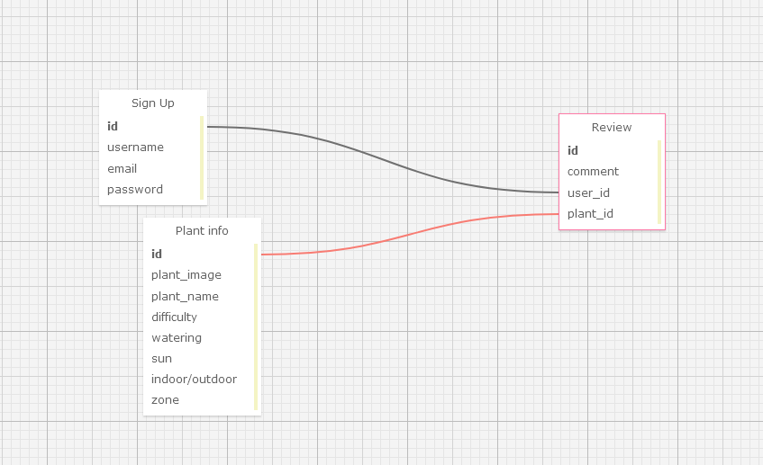
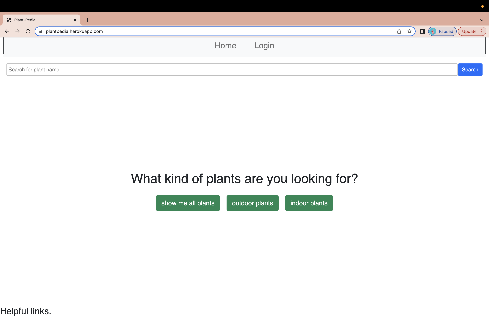

# plant-pedia

## Data Model

## Description

- This website includes a user system where people visiting the website can login to their own accounts.
- Once the user signs in they can look at a variety of different plants, able to look at outdoor and indoor plants, as well as seeing a difficulty rating for each plant.
- Our group decided to make this our website because we love plants and we wanted to find a way to help people get plants without them getting plants that they could not properly care for or plants that would not work for them.
- We came up with a way for people to not only find plants that could work for them in any environment, but we also rated such plants so that begineers or people who do not have enough time to care for more difficulty plants would not get plants just for them to die.
- Another feature we added was the ability for other users to leave comments on the plants so that people looking for them would be able to get even more information and learn things that we might of not included on our website.

## Usage

This website allows the user to view and search for plants. The user can select to see outdoor, indoor, or all plants. These plants are ranked by difficulty of care when listed for the user. Users can also rate these plants and view ratings from other people on them as well.

## Deployed App

## github Link

https://nextcentury-coders.github.io/Plant-pedia/

## Heroku deployed app

https://plantpedia.herokuapp.com/

## Credits

- David Kolodziej - Backend/Frontend
- Lucas Kincaid - Frontend
- Mikaela Montesclaros - Frontend
- Mohamed Elhelw - Backend/Frontend
- Martin Lynch - Backend

## License

MIT License